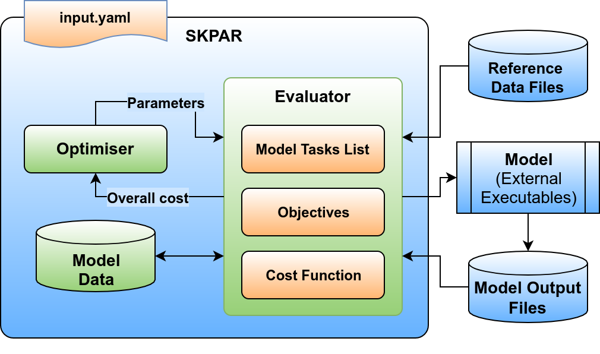

.. index:: about

.. _about:

==========
About
==========

SKPAR is a software tool intended to automate the optimisation of 
parameters for the Density Functional Tight Binding (DFTB) theory.
It allows a flexible and simultaneous use of diverse reference data,
e.g. from DFT calculations or experimentally obtained physical quantities.

.. _`Fig. 1`:

        **Fig. 1. Conceptual block diagram of SKPAR.**

Conceptual Overview
==============================

The conceptual diagram of SKPAR is shown in Fig. 1, where the relation between
the following entities is suggested:

    * **Model** -- a collection of executables outside SKPAR
      that produce some data; In the context of DFTB parameterisation 
      the model may encompass Slate-Koster table generation (driven by some
      parameters per chemical element), and a number of DFTB calculations
      that yield total energy and band-structure for one or more atomic 
      structures. *SKPAR features a dynamic model setup via the declaration
      of a 'Model Task-List' in the SKPAR input file; There is no hard-coded
      application-specific model.*

    * **Objectives** -- a set of single valued functions that depend on the 
      model parameters; Typical example is a root-mean-squared deviation 
      between some reference data (e.g. band-structure calculated by DFT)
      and the model data (e.g. the band-structure calculated by DFTB).
      *SKPAR provides a generic facility for declaring objective function 
      by specifying a list of Objectives in the input file; the specification
      includes instruction on accessing reference data and determines a
      query into the model and reference databases.*

    * **Reference data** -- a set of data items that we want the model to be
      able to reproduce within certain error tolerance; Reference data may 
      come from DFT calculations or be experimentally obtained.
      *SKPAR admits explicit reference data in the input file, or instructions
      on how to obtain reference data by accessing and interpreting
      external files; support for database query is under development too.*

    * **Cost function** -- a scalar function of the individual objectives 
      mentioned above that yields a single number representative of the 
      quality of a given set of parameter values. *Currently SKPAR supports
      only weighted root mean squared deviation of the objectives from zero.*

    * **Optimiser** -- an algorithm for efficient exploration of the parameter
      space with the aim of minimising the cost function. *SKPAR 
      features particle-swarm-optimisation (PSO) algorithm.*
      
The sole purpose of the *Optimiser* in Fig. 1 is to generate parameters in a way 
that does not depend on the specifics of the model being optimised.
The *Evaluator* in Fig. 1 acts as an interface between the embodiment of the
*Model* by one or more external executables, and the *Optimiser*.

The declaration of objectives and model tasks, as well as the overall functionality
of SKPAR is controlled by an input file (in YAML_ format), where the user must 
define as a minimum:

    1. A list of tasks that must be executed in order to obtain model data.

    2. A list of objectives that must be evaluated in order to assess overall cost.

    3. The optimisation strategy -- algorithm, parameters, etc.

    4. Aliases to complex commands involving external executables

The optimisation loop realised by SKPAR is shown in Fig. 2.

.. _`Fig. 2`:

.. figure:: _static/optimisation.flowchart.png
        :width: 70%

        **Fig. 2. Optimisation loop realised by SKPAR.**

Implementation Overview
==============================

SKPAR is implemented in `Python`_ and currently uses a Particle Swarm 
Optimisation (PSO) engine based on the `DEAP`_ library for evolutionary
algorithms. Its control is done via an input file written in YAML_.

Currently SKPAR provides two sub-packages: ``core`` and ``dftbutils``.

The ``core`` package is of general nature, and its coupling to 
``dftbutils`` is only via a tasks dictionary, through which SKPAR
learns how to acquire data related to a DFTB model.

The ``dftbutils`` package concerns with all that is necessary to obtain
data from a DFTB calculation. Presently, this package is limited in its
support to the executables provided by BCCMS at the University of Bremen,
Germany. 
This assumes:

    * SKGEN is used for Slater-Koster File (.skf) generation (by ``slateratom``, 
      ``twocnt``, and SKGEN), 
    * DFTB+ is used as the DFTB calculator, and
    * dp_bands is used as post-processor of eigenvalue data to produce 
      band-structure data.

However, an easy extension to alternative tool-flow is possible, and current
development aims to completely decouple model execution from the core of SKPAR.

.. seealso:: 
    Subpackages and modules

    Development

Extensions
==============================
The design of SKPAR features weak coupling between the core engine that
deals with a general multi-objective optimisation problem, and the specifics
of model execution that yields model data for a given set of parameter values.
Therefore, its extension beyond DFTB parameterisation -- e.g. to the closely 
related problems of parameter optimisation for empirical tight-bining (ETB) 
Hamiltonians or classical interatomic potentials for molecular dynamics,
should be straightforward.

.. _`Python`: http://www.python.org
.. _`DFTB+`: http://www.dftb-plus.info/
.. _Lodestar: http://yangtze.hku.hk/new/software.php
.. _dftb.org: http://www.dftb.org/home/
.. _`MIT license`: https://opensource.org/licenses/MIT
.. _`DEAP`: http://deap.readthedocs.io/en/master/
.. _`YAML`: http://pyyaml.org/wiki/PyYAMLDocumentation
