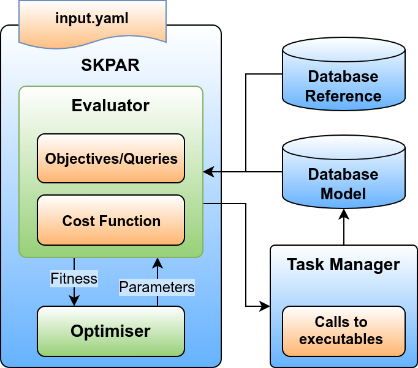

.. index:: develop

.. _develop:

====================
Development
====================

Further development of SKPAR is along the following lines.

External Model and Reference Database
----------------------------------------------------------------------
The aims is to completely decouple the core of the optimisation 
engine from the application specifics. To achieve this:

    * the internal model database dictionary must be taken out of the core 
      sub-package and queries must be made to address an external database;
    * the task handling has to be done by an external task manager, which 
      can be application specific, and its setup may be still driven by
      the input YAML file of SKPAR;
    * an external task-manager is needed to wrap the executables that yield
      model data and make them store that data in the external model database;
    * support for reference databases should complement the current mechanism
      through which the declaration of objectives is realised.

A conceptual block-diagram of the intended development is shown below.

        **Conceptual block diagram of SKPAR with external model database**

Implementation should be straightforward, e.g. by deploying TinyDB_ or similar.

.. _`TinyDB`: https://pypi.python.org/pypi/tinydb

As far as task-manager is concerned, ``dftbutils bands`` already represents
an example in this direction, short of putting data in a database.

Parallelisation
----------------------------------------------------------------------
The calculations done within SKPAR consume negligible time in comparison to
the evaluation of the model.
The executables embodying the model are computationally very intense but are
typically parallelised. 
However, much gain may be obtained by parallelising the evaluation of individuals
within the population (e.g. per particle, when PSO algorithm is used).
