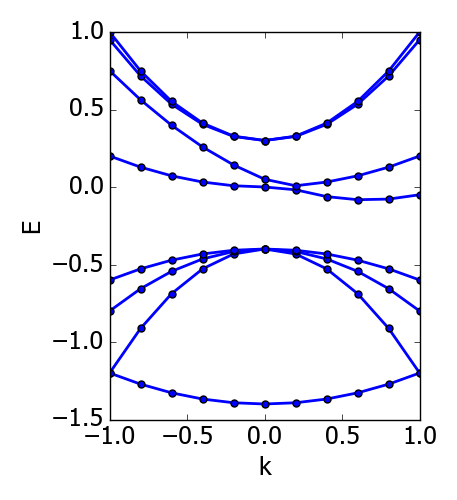

.. index:: objectives

.. _reference.objectives:

======================================================================
Objectives
======================================================================
Central to optimisation are objectives, which in an abstract sense 
define the direction in which to steer the process of parameter
refinement. The optimisation problem is defined as a weighted 
multi-objective optimisation, where each objective typically is 
associated with multiple data items itself. 
Each objective is scalarized, meaning that it is evaluated to a 
single scalar that represents its own cost or fitness. 
Each objective is assigned a weight, corresponding to its relative 
significance; weights are automatically normalised. 
Marler and Arora provide a good review on multi-objective
optimisation [MOO-review]_.

The declaration of an objective establishes a way for a direct 
comparison between some reference data and some model data.
With each pair of items from the reference and model data
there is associated a weight, referred to as sub-weight
that corresponds to the significance of this item relative to the 
rest of the items associated with an objective.
These sub-weights are used in the scalarisation of the objective,
and are also normalised.

Overview of Objectives Declaration
======================================================================

The declaration of an objective in the input file of SKPAR consists of
the following elements:

.. code-block:: yaml

    objectives:
        - query: # a name selected by the end-user
            doc: "Doc-string of the objective (optional)"
            models: 
                # Name of models having query_item in their database (mandatory)
            ref: 
                # Reference data or instruction on obtaining it (mandatory)
            options:
                # Options for interpretation of reference/model data (optional)
            weight: 
                # Weight of the objective (dflt: one)
            eval: 
                # How to evaluate the objective (dflt: [rms, abserr]

An example of the simplest objective declaration -- the band-gap
of bulk Si in equilibrium diamond lattice -- may look like that:

.. code-block:: yaml

    objectives:
        - Egap:
            doc: 'Si-diam-100: band-gap'
            models: Si.diam.100
            ref: 1.12
            weight: 5.0
            eval: [rms, relerr]

.. seealso::

   * :ref:`tutorials`

Details of Objective Declaration
======================================================================

Query Label (:code:`query`)
----------------------------------------------------------------------
:code:`query` is just a label given by the user. SKPAR does not interpret
these labels but uses them to query the model database in order to
obtain model data. Therefore, the only condition that must be met when
selecting a label is that the label must be available in the database(s)
of the model(s) that are listed after :code:`models`.

It is the responsibility of the Get-Tasks to satisfy this condition.
Recall that a get-task yields certain items (key-value pairs) in the
dictionary that embodies the model database accessed as a destination 
of the task.

Certain get-tasks allow the user to define the key of the item, and
this key can be used as a query-label when declaring an objective.
Example of that is shown in :ref:`Tutorial 1 <tutorial-1>`, where
the simple :code:`get_model_data` task is used, and the query label 
is ``yval``.

Other tasks yield a fixed set of items -- examples are the 
get-tasks provided by the ``dftbutils`` package.
Please, consult their documentation to know which items are 
available as query-labels: :ref:`get-functions`.

There is one case however, in which the above significance of 
:code:`query` is disregarded, and the specified label becomes irrelevant. 
This is the case where the reference data of an objective is itself a
dictionary of key-value pairs (or results in such upon acquisition 
from a file). This case is automatically recognised by SKPAR and the 
user need not do anything special. 
The query-label in this case can be something generic.
Example of such an objective can be found in 
:ref:`Tutorial 2 <tutorial-bs-exp>`, with queries labeled as
:code:`effective_masses` or :code:`special_Ek`.

Doc-string (:code:`doc`)
----------------------------------------------------------------------
This is an optional description -- preferably very brief, which would
be used in reporting the individual fitness of the objective, and
also as a unique identifier of the objective (complementary to its
index in the list of objectives).
If not specified, SKPAR will assign the following doc-string automatically:
``doc: "model_name: query_item"``.

Model Name(s) (:code:`models`)
----------------------------------------------------------------------
This is a single name, or a list of names given by the user, and is
a mandatory field. A model name given here must be available in the
model database. For this to happen, the model must appear as a 
*destination* of a Get-Task declaration (see :ref:`get_tasks`).

Beyond a single model name and a list of model names, SKPAR supports
also a list of pairs -- [model-name, model-factor].
In such a definition, the data of each model is scaled by the 
model-factor, and a summation over all models is done, prior to 
comparison with reference data.

Therefore, the three (nonequivalent) ways in which models can be specified are:

.. code-block:: yaml

    objectives:
        - query:
            # other fields
            models: name   # or [name, ]
            # or
            models: [name1, name2, name3..., nameN]
            # or
            models:
                - [name1, factor1]
                - [name2, factor2]
                # ...
                - [nameN, factorN]

Reference Data (:code:`ref`)
----------------------------------------------------------------------
Reference data could be either explicitly provided, e.g.:
:code:`ref: [1.5, 23.4]`, or obtained from a file.
The latter gives flexibility, but is correspondingly more complicated.

Loading data from file is invoked by:

.. code-block:: yaml

    objectives:
        - query
            # other fields in the declaration
            ref:
                file: filename
                # optional
                loader_args: {key:value-pairs}
                # optional
                process:
                    # processing options

SKPAR loads data via `Numpy loadtxt() function`_, and the optional
arguments of this function could be specified by the user via
``loader_args``

.. _`Numpy loadtxt() function`: https://docs.scipy.org/doc/numpy-1.12.0/reference/generated/numpy.loadtxt.html

Typical loader-arguments are:

    * :code:`unpack: True` -- transposes the input data; 
      mandatory when loading band-structure produced from 
      ``dp_bands`` or ``vasputils``

    * :code:`dtype: {names: ['keys', 'values'], formats: ['S15', 'float']}` -- loads string-float pairs; 
      mandatory when the reference data file consists of key-value pairs per line.

The ``process`` options are interpreted only for 2D array data (ignored
otherwise), and are as follows:
    
    * :code:`rm_columns: index, list_of_indices, or, range_specification`
    * :code:`rm_rows:    index, list_of_indices, or, range_specification`
    * :code:`scale:      scale_factor`

**NOTABENE:** The indexes apply to the rows and columns of the file, and are therefore 
independent of the loader arguments (i.e. prior to potential transpose 
of the data). The indexes and index ranges are Fortran-style -- counting 
from 1, and inclusive of boundaries.

**Example:**

.. code-block:: yaml

    objectives:
        - query:
          ...
          ref:
            file: filename
            process:
                rm_columns: 1                # filter k-point enumeration, and bands, potentially
                rm_rows   : [[18,36], [1,4]] # filter k-points if needed for some reason
                scale     : 27.21            # for unit conversion, e.g. Hartree to eV, if needed
          ...

Objective Weight (:code:`weight`)
----------------------------------------------------------------------
This is a scalar, corresponding to the relative significance of the 
objective compared to the other objectives. Objective weights are
automatically normalised so that there sum is one.

Evaluation function (:code:`eval`)
----------------------------------------------------------------------
Each objective is scalarised by a cost function that can be optionally
modified here. Currently only Root-Mean-Squared Deviation is supported,
but one may choose whether absolute or relative deviations are used.
The field is optional and defaults to RMS of absolute deviations.

.. code-block:: yaml

    objectives:
        ...
        - query:
            ...
            eval: [rms, abserr] # default, absolute deviations used
            # or
            eval: [rms, relerr] # relative devations

Options (:code:`options`)
----------------------------------------------------------------------
Options depend on the type of objective.
One common option is ``subweights``, which allows the user to specify
the relative importance of each data-item in the reference data.
These sub-weights are used in the cost-function representing the
individual objective. 

For details, see the sub-weights associated with different 
:ref:`types of objectives` below.

.. _`types of objectives`:

Reference Data And Objective Types
======================================================================

The format of reference data could be:

    * single item: e.g. a scalar representing the band-gap of a 
      semiconductor, or a reaction energy;
      
    * 1-D array: e.g. the energy values of an energy-volume relation 
      of a solid;

    * 2-D array: e.g. the band-structure of a solid, i.e. the set of 
      eigenstates at different *k*-number;

    * key-value pairs: e.g. named physical quantities, like effective
      masses, specific E-k points within the first Brilloin zone, etc.

Declaring an objective for a single model is straight forward, and in
this case a signle item reference data may be thought of as a 
special case of 1-D array. 
However, the distinction between the two makes sense if we want to 
construct an objective based on more than one models, as shown further 
below. 

There are five types of objectives. The type is deduced from the
combination of *format of the reference data* and *number of model names*.
Therefore, SKPAR automatically distinguishes between the following five
objectives types:

1) Single model, single item/1-D array reference data
--------------------------------------------------------------------------------
This is the simplest objective type that associates one or more (1-D array) 
items with a query of one model.

In the case of an array reference data, one option is admitted: ``subweights``.
The number of sub-weights must match the length of the reference data array.
Sub-weights are normalised automatically.

**Example:**

.. code-block:: yaml

    objectives:
        # single model, single scalar reference data
        - band_gap:
            ref: 1.12
            models: Si/bs

        # single model, 1-D array reference data
        - levels:
            ref: [-13.6, -5, -3.0]
            options:
                subweights: [1, 1, 2]
            models: molecule

2) Single model, 2-D array reference data
---------------------------------------------------------------------
This objective type allows for greater flexibility in defining the
association between individual reference and model data items, which
may not be the trivial one-to-one correspondence between the entire
arrays yielded by the query item.

The 2-D arrays (of reference and model data) are viewed as composed 
of *bands* -- each row is referred to as a *band*, each column is 
referred to as a *point*.
A visual representation of the concept is shown in `Fig. 3`_.

.. _`Fig. 3`:

        **Fig. 3. Visual representation of a 2-D array in terms of bands.
        Each data item in the array is a circle on the plot. The lines
        represent the association of a row of data in the array with a band.**

Correspondence between different bands of the model and reference data can be 
established via the following options:

    * ``use_ref: [...]`` 
    
    * ``use_model: [...]`` 

    * ``align_ref: [...]`` 

    * ``align_model: [...]`` 

The ``use_`` options admit a list of indexes, ranges, or a mix of indexes and 
ranges -- e.g. ``[[1, 4], 7, 9]``, and instruct SKPAR to retain only the 
enumerated bands for the comparison of the resulting 2-D sub-arrays of 
model and reference data.
Fortran-style indexing must be used, i.e. counting starts
from 1, and ranges are inclusive of both boundaries.

**NOTABENE:** 
In any case, the final comparison (model *vs* reference) is over arrays of 
identical shape, and the resulting arrays after the ``use_`` clause should 
be of the same shape.

The ``align_`` options instruct SKPAR to subtract the value of a specific
data item in the array from all values in the array, i.e. change the
reference. This option admits a pair of band-index and point-index, or
a pair of band-index and a function name (``min`` or ``max``) to operate
on the indexed band. In either case, the value of the indexed data item or
the value returned from the function is subtracted from the model or
reference data prior to objective evaluation.

This objective type also admits ``subweights`` option, but in this case the
correspondence between sub-weights and data items needs more flexible 
specification. This is to avoid the necessity of providing a full 2-D array
of sub-weight coefficients for each data item.
The following sub-options facilitate that:

.. code-block:: yaml

    objectives:
        ...
        - bands:
            ...
            options:
                ...
                subweights:
                    dflt: 1.0
                    values: [[[value range], subweight], ...]
                    bands: [[[band-index range], subweight], ...]

.. note::

    Correspondence between sub-weights and data, per data item, is established 
    **after** the application of ``use_`` and ``align_`` options have taken effect.

**Example:**

.. code-block:: yaml

    objectives:

        - bands: 
            doc: Valence Band, Si
            models: Si/bs
            ref: 
                file: ./reference_data/fakebands.dat # 
                loader_args: {unpack: True}
                process:       # eliminate unused columns, like k-pt enumeration
                    # indexes and ranges below refer to file, not array, 
                    # i.e. independent of 'unpack' loader argument
                    rm_columns: 1                # filter k-point enumeration, and bands, potentially
                    # rm_rows   : [[18,36], [1,4]] # filter k-points if needed for some reason
                    # scale     : 1                # for unit conversion, e.g. Hartree to eV, if needed
            options:
                use_ref: [[1, 4]]                # fortran-style index-bounds of bands to use
                use_model: [[1, 4]]
                align_ref: [4, max]              # fortran-style index of band and k-point,
                align_model: [4, max]            # or a function (e.g. min, max) instead of k-point
                subweights: 
                    # NOTABENE:
                    # --------------------------------------------------
                    # Energy values are with respect to the ALIGNEMENT.
                    # If we want to have the reference  band index as zero,
                    # we would have to do tricks with the range specification 
                    # behind the curtain, to allow both positive and negative 
                    # band indexes, e.g. [-3, 0], INCLUSIVE of either boundary.
                    # Currently this is not done, so only standard Fortran
                    # range spec is supported. Therefore, band 1 is always
                    # the lowest lying, and e.g. band 4 is the third above it.
                    # --------------------------------------------------
                    dflt: 1
                    values: # [[range], subweight] for E-k points in the given range of energy
                    # notabene: the range below is with respect to the alignment value
                        - [[-0.3, 0.], 3.0]
                    bands: # [[range], subweight] of bands indexes; fortran-style
                        - [[2, 3], 1.5]   # two valence bands below the top VB
                        - [4 , 3.5]       # emphasize the reference band
            weight: 3.0

3) Single model, key-value pairs reference data
--------------------------------------------------------------------------------
For this objective, a number of queries are made over a single model. 
The reference data is a dictionary of key-value pairs.
Note that the name of the objective (*meff* below) has a generic meaning, and is 
*not* defining the query items. Instead, The queries are based on the keys from 
the reference data.
    
One options is admitted -- ``subweights``, and its value must be a dictionary 
associating a weighting coefficient with a key.
One of the subweight-keys is ``dflt``, allowing to specify a weight simultaneously 
over all keys. The subweights are normalised automatically.
A key is excluded from the queries if its sub-weight is 0.
    
**Example:**

.. code-block:: yaml

    objectives:

        - meff: 
            doc: Effective masses, Si
            models: Si/bs
            ref: 
                file: ./reference_data/meff-Si.dat
                loader_args: 
                    dtype:
                    # NOTABENE: yaml cannot read in tuples, so we must
                    #           use the dictionary formulation of dtype
                        names: ['keys', 'values']
                        formats: ['S15', 'float']
            options:
                subweights: 
                    # consider only a couple of entries from available data
                    dflt: 0.
                    me_GX_0: 2.
                    mh_GX_0: 1.
            weight: 1.5

4) Multiple models, single item reference data
-----------------------------------------------------------------------------------------

    All of the models are queried individually for the same query-item, and the result
    is scaled by the non-normalised model-weights or model factors, prior to performing
    summation over the data, to produce a single scalar. This scalar is seen as a new
    model data item. Accordingly, reference data is a single value too.
    This type of objective is convenient for expressing reaction energies as targets.

**Example:**

.. code-block:: yaml

    objectives:
        - Etot:
            doc: "heat of formation, SiO2"
            models: 
                - [SiO2-quartz/scc, 1.]
                - [Si/scc, -0.5] 
                - [O2/scc, -1]
            ref: 1.8 

5) Multiple models, 1-D array reference data
-----------------------------------------------------------------------------------------

    A single query per model is performed, over several models.
    The dimension of the 1-D array of reference data must match the number of models.

    The admitted option is ``subweights`` -- a list of floats, being normalised 
    weighting coefficients in the cost function of the objective.
    This type of objective is convenient for expressing energy-volume relation as
    target, where the different models correspond to different volume.

**Example:**

.. code-block:: yaml

    objectives:
        - Etot:
            models: [Si/scc-1, Si/scc, Si/scc+1,]
            ref: [23., 10, 15.]
            options:
                subweights: [1., 3., 1.,]

**REFERENCES**

.. [MOO-review] R.T. Marler and J.S. Arora, Struct Multidisc Optim 26, 369-395 (2004),
                "Survey of multi-objective optimization methods for engineering"

