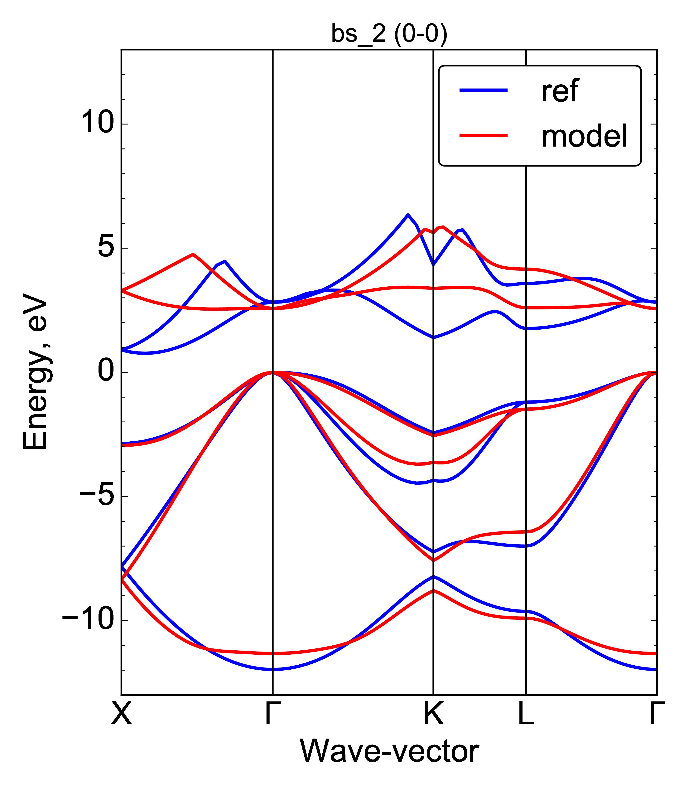

.. index:: tasks

.. _reference.tasks:

Tasks
======================================================================
SKPAR features dynamic model definition by the user, which greatly
enhances its flexibility. The model is defined by a sequence of tasks,
which represent the steps needed to obtaining model data. 
The tasks are declared in the input file and are executed in the given 
sequence at each iteration. 

There are three task categories:

    * **Set** -- model update -- updates the model environment with 
      the parameters generated by the optimiser at a given iteration;

    * **Run** -- model execution -- executes external programs, 
      scripts or commands, to perform the necessary model calculations;

    * **Get** -- collection of model data -- acquire the relevant data 
      from the various output files created during model execution.

    * **Plot** -- plotting of objectives data (model and reference) -- 
      produce visual representation of objectives at each iteration;
      Plot-tasks are optional.

Refer to :ref:`Fig. 2` for the corresponding steps in the optimisation
flow.

The signature of each category and a brief usage is shown below. 

For more complete examples see :ref:`tutorials`.

NOTABENE:

    Tasks should be entered as list items of the ``tasks:`` section in
    the input YAML file.

.. _`set_tasks`:

Set Tasks
--------------------------------------------------

.. code-block:: yaml

    tasks:
        - set: [parameter_file, work_directory, optional_templates]

Set-tasks serve to communicate the parameter values generated by the
optimiser to the model.

The parameters (including iteration number and possibly parameter names)
are written to ``parameter_file`` in ``work_directory``, for which standard 
rules apply: '~' is expanded to user directory, and if there is no 
path component included then it is relative to '.'.
Default parameter file is ``current.par``, and 
default work-directory is ``.`` if not explicitly specified.

The most important feature of the set task is its ability to update 
template files -- ``optional_templates``, according to the dictionary of 
parameters used in SKPAR.
The following rules apply in this respect:

    * ``optinonal_templates`` is a filename or a list of filenames with
      the following structure: ``template.something`` or 
      ``something.template.somthingelse``;
    * template files must contain named place-holders which are substituted
      for the corresponding parameter values;
    * upon substitution, the output files bear the name of the
      template, except for the ``template.`` part being removed --
      for example: `skdefs.template.py` becomes `skdefs.py`;
    * templates are expected to be in ``work_directory``, if they have
      no path component; else, standard path expansion applies;
    * place holders should be in the old string-formatting syntax for Python,
      i.e. ``%(parameter_name)parameter_type``; 
      NOTABENE: NO space after closing bracket!

.. _`run_tasks`:

Run Tasks
--------------------------------------------------

.. code-block:: yaml

    tasks:
        - run: [command, work_directory, input, output]

Run-tasks help to define model that must be optimised in a flexible
way, depending on the specific problem *without* modifying SKPAR.

The mandatory ``command`` argument is a string or list of strings and
may include options and arguments of an external executable, 
shell command, or a script.

The command is executed in ``work_directory``, for which standard 
rules apply: '~' is expanded to user directory, and if there is no 
path component included then it is relative to '.'.
Default work-directory is '.' if not explicitly specified.

The ``input`` and ``output`` files are optional and default to ``None``
and ``out.log`` in the working directory.

Run tasks support aliasing via the :ref:`reference.executables` section.

.. _`get_tasks`:

Get Tasks
--------------------------------------------------

.. code-block:: yaml

    tasks:
        - get: [get_function, source, destination, func_arguments]

Get-tasks serve to collect model data from `source`, optionally perform
some analysis on it and put the result as a key-value item at the 
`destination`.
The `destination` is an embodiment of the database of a model, which
allows queries of the values corresponding to the available keys.
(see :ref:`Fig. 1` and :ref:`Fig. 2`).

The signature of get-tasks shown above relies on a dictionary of known 
functions, which are mostly model-specific.

.. _`get-functions`:

Available get-functions
.........................

The ``get_function`` must be one of those accessible to the user, as
as listed in :py:mod:`skpar/core/taskdict.py`:

.. list-table::

    * - **Generic**
      -
    * - :py:func:`get_model_data <skpar.core.taskdict.get_model_data>`
      - Generic routine based on ``numpy.loadtxt()``

    * - **Specialised: DFTB+**
      -
    * - :py:func:`get_dftbp_data <skpar.dftbutils.queryDFTB.get_dftbp_data>` 
      - Get data resulting from a DFTB+ calculation, e.g. in `detailed.out`.

    * - :py:func:`get_dftbp_bs <skpar.dftbutils.queryDFTB.get_bandstructure>` 
      - Get all data from DFTB+/dp_bands calculation of bandstructure.

    * - :py:func:`get_dftbp_meff <skpar.dftbutils.queryDFTB.get_effmasses>`
      - Extract effective masses from DFTB+/dp_bands calculation of bandstructure.

    * - :py:func:`get_dftbp_Ek <skpar.dftbutils.queryDFTB.get_special_Ek>`
      - Extract named *E-k* points from DFTB+/dp_bands calculation of bandstructure.

Source and Destination
........................

Beyond the mandatory ``get-function`` name, a get-task must have: 

    * ``source`` (mandatory, string) -- a directory name or a dictionary
      in the model database;
      
    * ``destination`` (optional, string) -- a dictionary in the model
      database; ``source`` is tried if destination is not given, and
      a dictionary is automatically allocated in the database when a
      destination is first used in a get-task;

Optional Arguments
....................

    * ``func_arguments`` (optional, dict) -- a dictionary of key-value
      pairs, being keyword arguments of the get-function invoked.
      The possible arguments for each get-function can be checked
      via the table below, with links to the implementations underlying
      the available get-functions.

.. _`plot_tasks`:

Plot Tasks
--------------------------------------------------

.. code-block:: yaml

    tasks:
        - plot: [plot_function, plot_name, list_of_objectives,
                    optional_abscissa_key,
                    optional_queries_list,
                    kwargs]

Plot tasks produce ``.pdf`` plots with specified ``plot_name``, visualising
the reference and model data associated with an objective at each iteration.
The filenames are tagged by an iteration number.

The data of the ``list_of_objectives`` is used as ordinate values. An objective
is selected by a pair-list of ``[query_name, model_name]``, 
e.g. ``bands: Si``.
The abscissa values may be obtained via the ``optional_abscissa_key``, or
alternatively, the index numbers of individual data items are used.
The ``optional_queries_list`` allows the plotting routine to obtain extra
data produced by the model at each evaluation, by declaring a query within
the plot-task.
Obviously, both the abscissa key and the extra query keys must be present 
in the model database, and this must be guaranteed by the use of
appropriate get-tasks. 

The plot is realised by the ``plot_function``, which should be selected
from the table below (follow hyperlinks for details):

.. list-table::

    * - :py:func:`plot_objvs <skpar.core.taskdict.plot_objvs>`
      - generic plotting of 1D or 2D data

    * - :py:func:`plot_bs <skpar.dftbutils.plot.plotBS>` 
      - specialised routine to plot bandstructures

Plot-Task Examples:
........................

1) Generic plot of a 1D array data:

.. code-block:: yaml

    tasks:
        ...
        # get both yval and xval from the model and put in poly3 database
        - get: [get_model_data, test_optimise/model_poly3_out.dat,  poly3, yval]
        - get: [get_model_data, test_optimise/model_poly3_xval.dat, poly3, xval]

        # plot yval of poly3 using xval of poly3 as abscissa key
        - plot: [plot_objvs, 'test_optimise/pdf/polyfit1', [[yval, poly3]], xval] 

    objectives:
        - yval:
            doc: 3-rd order polynomial values for some values of the argument
            models: poly3
            ref: [ 36.55, 26.81875, 10., 13.43125,  64.45 ]
            eval: [rms, relerr]

.. _`Fig. 4`:

.. figure:: _static/polyfit1_0-0.png
        :width: 50%

        **Fig. 4. 1-D array plotted with the generic ``plot_objvs`` function**

2) Generic plot of a 2D array data. 

This example plots a bandstructure (a fake one). Two problem with the resulting plot below
is its integer x-axis, i.e. the k-line lengths are (generally) not
correct, since k-point index is used as an abscissa; no labels either.

.. code-block:: yaml

    tasks:
        ...
        # load bands in fakemodel database; transpose input array after removing column 1
        - get: [get_model_data, reference_data/fakebands-2.dat, fakemodel, bands,
                        {loader_args: {unpack: True}, process: {rm_columns: [1]}}]
        # plot the bands using y-value index (along axis 1) as an x-value
        - plot: [plot_objvs, 'test_optimise/pdf/fakebandsplot', [[bands, fakemodel]]] 

    - bands:
        models: fakemodel
        ref: 
            file: reference_data/fakebands.dat
            loader_args: {unpack: True}
            process:
                rm_columns: [1, 2, [8, 9]]

.. _`Fig. 5`:

.. figure:: _static/fakebandsplot_0-0.png
        :width: 50%

        **Fig. 5. 2-D array data plotted by the generic plot_objvs function**

3) Specialised plot of a bandstructure.

This example plots a bandstructure properly. For this, the x-values are constructed
and passed as an abscissa value. Moreover, it shows how to handle the case where
the bandstructure information is split over three different objectives -- we have
one objective for the band-gap, another for the valence bands and yet another
for the conduction band, and both VB and CB are 0-aligned.
The magic here relies on:
    
    * strict definition of objectives with ``bands`` query: first VB, then CB
    * strict enumeration of objectives: fisrt ``Egap``, then ``bands``

.. code-block:: yaml

    tasks:
        ...
        # Get all data from DFTB+/dp_bands. This includes all needed for BS plot,
        # including 'Egap', 'bands', 'kticklabels'
        - get: [get_dftbp_bs, Si-diam/100/bs, Si.diam.100, 
                {latticeinfo: {type: 'FCC', param: 5.431}}]

        # The plot_bs does magic when it sees the first objective being 'Egap'.shape==(1,)
        # it shifts the CB by the band-gap, so the band-structure is properly shown.
        # For this to happen, objectives declaration must be such that VB precedes CB!!!
        # The plot_bs will also show k-ticks and labels if requested, as below via
        # 'kticklabels'
        - plot: [plot_bs, Si-diam/100/bs/bs_2, [[Egap, Si.diam.100], [bands, Si.diam.100]], 
                    kvector, queries: [kticklabels]]

    objectives:
        - Egap:
            doc: 'Si-diam-100: band-gap'
            models: Si.diam.100
            ref: 1.12
            weight: 5.0
            eval: [rms, relerr]

        - bands:
            doc: 'Si-diam-100: VALENCE band'
            models: Si.diam.100
            ref:
                file: ~/Dropbox/projects/skf-dftb/Erep fitting/from Alfred/crystal/DFT/di-Si.Markov/PS.100/band/band.dat
                loader_args: {unpack: True}
                process:  
                    rm_columns: 1      # filter k-point enumeration
            options:
                use_ref: [[1, 4]]                # Fortran-style index-bounds of bands to use
                use_model: [[1, 4]]
                align_ref: [4, max]              # Fortran-style index of band-index and k-point-index,
                align_model: [4, max]            # or a function (e.g. min, max) instead of k-point
            eval: [rms, relerr]

        - bands:
            doc: 'Si-diam-100: CONDUCTION band'
            models: Si.diam.100
            ref:            
                file: ~/Dropbox/projects/skf-dftb/Erep fitting/from Alfred/crystal/DFT/di-Si.Markov/PS.100/band/band.dat
                loader_args: {unpack: True}
                process:
                    rm_columns: 1      # filter k-point enumeration
            options:
                use_ref: [5, 6]                # fortran-style index enumeration: NOTABENE: not a range here!
                use_model: [5, 6]              # using [[5,6]] would be a range with the same effect
                align_ref: [1, 9]              # fortran-style index of band and k-point, (happens to be the minimum here)
                align_model: [1, min]          # or a function (e.g. min, max) instead of k-point
            eval: [rms, relerr]

.. _`Fig. 6`:

        **Fig. 6. Band-structure plotted by the ``plot_bs`` function**

