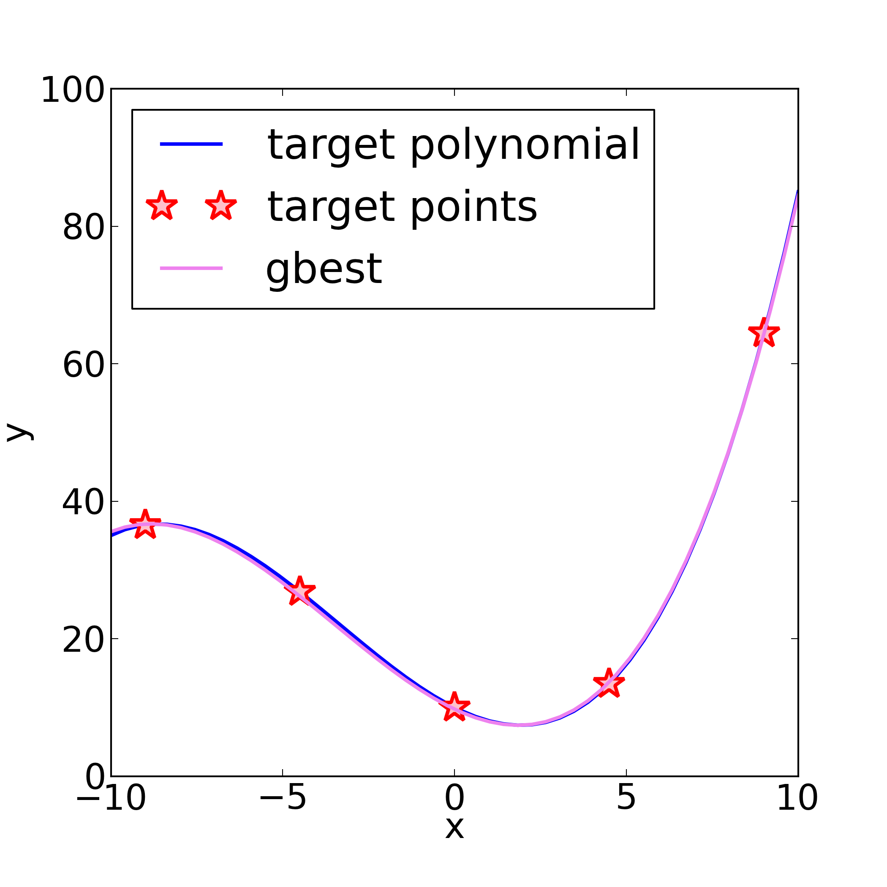

.. _tutorials:

===============
Tutorials
===============

Conceptual overview (polynomial fitting)
=============================================================
This example covers the basic structure and content of the
input file. The input file, e.g. `skopt_in.yaml`, would
typically reside in the invocation directory.
The models should have separate execution directories,
typically within the invocation folder.

The relevant files for the example are under ``skopt/test`` directory:

    * ``test_optimise.yaml``, and the folder
    * ``test_optimise/``, where the model 
    * ``test_optimise/model_poly3.py`` is executed (and located)

The example can be run in the ``skopt/test`` directory by invoking:

    * ``skopt test_optimise.yaml``,

assuming that skopt is installed.

Input YAML file
------------------------------

In this example we try to fit a 3-rd order polynomial to a few points 
extracted from a such a polynomial.

The setup of SKOPT consists of 4 items:

    1. A list of objectives that steer the optimisation,
    2. A list of tasks necessary to evaluate the model,
    3. An optional dictionary of aliases (used in the task list) resolving to external executables,
    4. A configuration of the optimisation engine (parameters, algorithm, cost-function).

The corresponding yaml file, `test_optimise.yaml`_ reads:

    .. code:: yaml

        tasks:
            - set: [current.par, test_optimise, template.parameters.py ]
            - run: [mypy model_poly3.py, test_optimise ]
            - get: [get_model_data, test_optimise/model_poly3_out.dat, poly3, yval]

        objectives:
            - yval:
                doc: 3-rd order polinomial values for some values of the argument
                models: poly3
                ref: [ 36.55, 26.81875, 10., 13.43125,  64.45 ]
                eval: [rms, relerr]

        optimisation:
            algo: PSO   # particle swarm optimisation
            options:
                npart: 4   # number of particles
                ngen : 5   # number of generations
            parameters:
                - c0:  9.95    10.05
                - c1: -2.49    -2.51
                - c2:  0.499    0.501
                - c3:  0.0499   0.0501

        executables:
            mypy: 'python -v'

The reference polynomial, the reference points from it (see ``ref: [...]`` 
in the yaml file above, and the fitted 3-rd order polynomial may look as so:

        **Comparison of reference and fitted (gbest) polynomials, and reference data points**

What is happening
------------------------------

**Objectives:**

A model named ``poly3`` should yield data named ``yval``, to be compared 
against explicitly provided reference data. Fitness evaluation of this
specific objective should be based on root-mean-squared relative deviations.

**Tasks (task-list):**

At each iteration do:

    1. Set the environment by writing the parameters to ``current.par`` and 
        substitute values in ``template.paramete.py`` to ``parameters.py``, 
        both files in ``./test_optimise`` folder.
    2. Run the command ``mypy`` in the ``./test_optimise`` folder with
        input file ``model_poly3.py``. 
    3. Get the model data from ``test_optimise/model_poly3_out.dat`` and
        associate it with the ``yval`` of model ``poly3`` in the model database.

**Optimisation**

Generate four parameters (with initial range as given by a pair of
min/max values) according to particle swarm optimisation algorithm,
using 4-particle swarm, evolving it for 5 generations.

**Executables**

Whenever a run-task requires ``mypy`` command, use ``python -v`` instead.

Optimisation of electronic parameters in DFTB
==================================================
A more elaborate example is fitting the electronic structure of bulk Si
to match a set of experimentally known *E-k* points and effective masses.

Here we set three different objectives, each of them contributing several
data items.

The corresponding ``skopt_in.yaml`` is below, with comment annotations:

.. code:: bash

    executables:
        skgen: ./skf/skgen-opt.sh   # script yielding an skf set
        bands: dftbutils bands      # band-structure calculation
                                    # see documentation for dftbutils sub-package

    tasks:
        # Three types of tasks exist:
        # - set: [parmeter_file, working_directory, optional_template_file(s)]
        # - run: [command, working_directory]
        # - get: [what, from_sourse(dir, file or dict), to_destination(dict), optional_kwargs]
        # ------------------------------------------------------------------------------
        - set: [current.par, skf, skf/skdefs.template.py]   # update ./skf/skdefs.py
        - run: [skgen, skf]                                 # generate SKF-set
        - run: [bands, Si-diam]                             # run dftb+ and dp_bands in Si-diam
        - get: [get_dftbp_bs, Si-diam/bs, Si.bs,            # get BS data in Si.bs model DB
                {latticeinfo: {type: 'FCC', param: 5.431}}] # must know the lattice for what follows
        - get: [get_dftbp_meff, Si.bs,                      # get electron effective masses
                {carriers: 'e', directions: ['Gamma-X'],    # note: destination is ommitted,
                 Erange: 0.005, usebandindex: True}]        #       hence update the sourse
        - get: [get_dftbp_meff, Si.bs,                      # get hole effective masses
                {carriers: 'h', directions: ['Gamma-X', 'Gamma-L', 'Gamma-K'], 
                 nb: 3, Erange: 0.005}]                     
        - get: [get_dftbp_Ek  , Si.bs,                      # get eigen-values at special points
                {sympts: ['L', 'Gamma', 'X', 'K'], 
                 extract: {'cb': [0,1,2,3], 'vb': [0,1,2,3]}, 
                 align: 'Evb'}]                             

    objectives:
        - Egap:                            # item to be queried from model database
            doc: Band-gap of Si (diamond)
            models: Si.bs                  # model name matches destination of get-tasks
            ref: 1.12
            weight: 4.0                    # relatively importance of this objective
            eval: [rms, relerr]            # RMS of relative error defines the fitness

        - effective_masses:                # items to be queried here will be defined by
            doc: Effective masses, Si      # explicit keys, since the reference data consists
            models: Si.bs                  # of key-value pairs
            ref: 
                file: ./ref/meff-Si.dat    # the data is loaded via numpy.loadtxt()
                loader_args:               
                    dtype:                 # NOTABENE: yaml cannot read in tuples, so we must
                                           #           use the dictionary formulation of dtype
                        names: ['keys', 'values']
                        formats: ['S15', 'float']
            options:
                subweights: 
                    dflt   : 0.1           # changing the default (from 1.) to 0. allows us to consider 
                    me_GX_0: 1.0           # only select entries; alternatively, set select entries
                    me_Xt_0: 0.0           # to zero effectively excludes them from consideration
            weight: 1.0
            eval: [rms, abserr]

        - special_Ek:
            doc: Eigenvalues at k-points of high symmetry
            models: Si.bs
            ref:
                file: ./ref/Ek-Si.dat
                loader_args: 
                    dtype:                 # NOTABENE: yaml cannot read in tuples, so we must
                                           #           use the dictionary formulation of dtype
                        names: ['keys', 'values']
                        formats: ['S15', 'float']
            options:
                subweights: 
                    dflt   : 0.1           # changing the default (from 1.) to 0. allows us to consider 
                    me_GX_0: 1.0           # only select entries; alternatively, set select entries
                    mh_Xt_0: 0.0           # to zero effectively excludes them from consideration
            weight: 1.0
            eval: [rms, relerr]

    optimisation:
        algo: PSO                          # particle swarm optimisation
        options:
            npart: 2                       # number of particles
            ngen : 2                       # number of generations
        parameters:
            - Si_Ed  :  0.1 0.3            # parameter names must match with placeholders in
            - Si_r_sp:  3.5 7.0            # template files given to set-tasks above
            - Si_r_d :  3.5 8.0

Opitmisation of repulsive potentials for DFTB
==================================================

.. _`test_optimise.yaml`: ../../../../test/test_optimise.yaml
